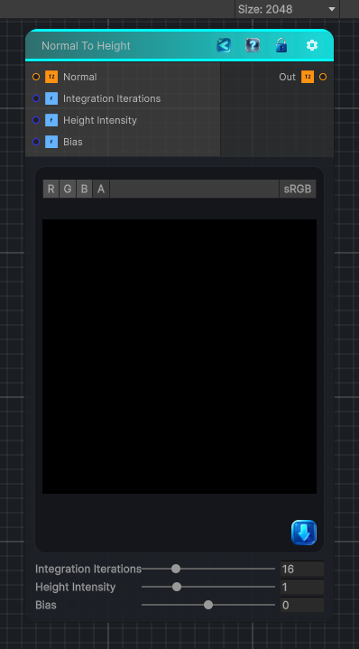

<link rel="stylesheet" href="../_assets/theme.css">

<button type="button" class="genesis-theme-toggle" data-genesis-theme-toggle aria-label="Toggle theme">Dark</button>

---
category: "Normal"
---

# Normal To Height

> A normal map encodes:

## Description

A normal map encodes:
N=(n_x,n_y,n_z)
Where n_x and n_y are proportional to the slope of the height field:
\frac{\partial h}{\partial x}=-\frac{n_x}{n_z},\quad \frac{\partial h}{\partial y}=-\frac{n_y}{n_z}
So to reconstruct height, we need to:
✔ Convert normal to slope
✔ Integrate slope across the image
✔ Use iterative accumulation (CRT‑safe)
✔ Provide intensity + bias controls
✔ Keep everything deterministic

## Inputs

| Name | Type | Description |
|------|------|-------------|
| Normal | Texture2D |  |
| Integration Iterations | Single |  |
| Height Intensity | Single |  |
| Bias | Single |  |

## Outputs

| Name | Type |
|------|------|
| Out | Texture2D |

## Parameters

| Setting | Type | Default | Description |
|---------|------|---------|-------------|
| Integration Iterations | Range | 16 | Controls the integration iterations. |
| Height Intensity | Range | 1.0 | Controls the height intensity. |
| Bias | Range | 0.0 | Controls the bias. |

## See Also

- [Back to Normal To Height](./normal-index.md)
