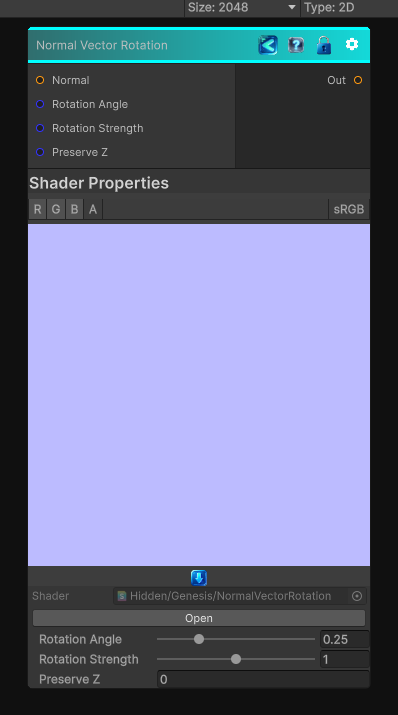

<link rel="stylesheet" href="../_assets/theme.css">

<button type="button" class="genesis-theme-toggle" data-genesis-theme-toggle aria-label="Toggle theme">Dark</button>

---
category: "Normal"
---

# Normal Vector Rotation

> Normal Vector Rotation is a fantastic utility node — it lets you rotate a tangent‑space normal map by an arbitrary angle, which is incredibly useful for:

## Description

Normal Vector Rotation is a fantastic utility node — it lets you rotate a tangent‑space normal map by an arbitrary angle, which is incredibly useful for:
- Rotating detail normals
- Aligning normals to flow maps
- Procedural anisotropy
- Stylized shading
- Direction‑driven normal variation

## Inputs

| Name | Type | Description |
|------|------|-------------|
| Normal | Texture2D |  |
| Rotation Angle | Single |  |
| Rotation Strength | Single |  |
| Preserve Z | Single |  |

## Outputs

| Name | Type |
|------|------|
| Out | Texture2D |

## Parameters

| Setting | Type | Default | Description |
|---------|------|---------|-------------|
| Rotation Angle | Range | 0.25 | Controls the rotation angle. |
| Rotation Strength | Range | 1.0 | Controls the rotation strength. |
| Preserve Z | Int | 0 | Controls the preserve z. |

## See Also

- [Back to Normal Vector Rotation](./normal-index.md)
