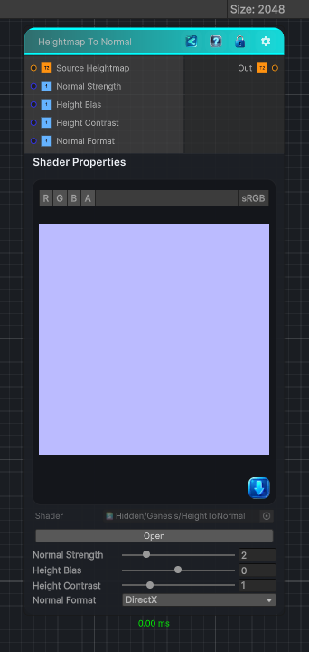

<link rel="stylesheet" href="../_assets/theme.css">

<button type="button" class="genesis-theme-toggle" data-genesis-theme-toggle aria-label="Toggle theme">Dark</button>

---
category: "Normal"
---

# To Normal

> Converts a height map to a tangent-space normal map in either DirectX or OpenGL format.

## Description

Converts a height map to a tangent-space normal map in either DirectX or OpenGL format.

## Inputs

| Name | Type | Description |
|------|------|-------------|
| Source Heightmap | Texture2D |  |
| Normal Strength | Single |  |
| Height Bias | Single |  |
| Height Contrast | Single |  |
| Normal Format | Single |  |

## Outputs

| Name | Type |
|------|------|
| Out | Texture2D |

## Parameters

| Setting | Type | Default | Description |
|---------|------|---------|-------------|
| nodeVariables | VariableStorage | AhahGames.GenesisNoise.Graph.VariableStorage | |
| GUID | String | 1030e337-e8f2-46f0-b68c-febf6e4efce6 | |
| expanded | Boolean | False | |

## See Also

- [Back to To Normal](./normal-index.md)
