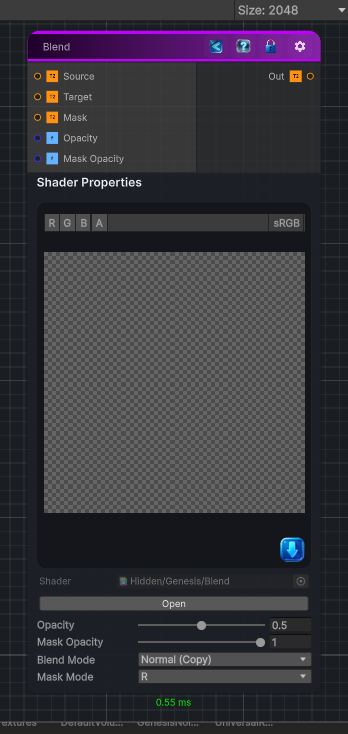

<link rel="stylesheet" href="../_assets/theme.css">

<button type="button" class="genesis-theme-toggle" data-genesis-theme-toggle aria-label="Toggle theme">Dark</button>

---
category: "Operations"
---

# Blend

> Blend between two textures, you can use different blend mode depending which texture you want to blend (depth, color, ect.).

## Description

Blend between two textures, you can use different blend mode depending which texture you want to blend (depth, color, ect.).

You also have the possibility to provide a mask texture that will affect the opacity of the blend depending on the mask value.
The Mask Mode property is used to select which channel you want the mask value to use for the blending operation.

Note that for normal blending, please use the Normal Blend node.

## Inputs

| Name | Type | Description |
|------|------|-------------|
| Source | Texture2D |  |
| Target | Texture2D |  |
| Mask | Texture2D |  |
| Opacity | Single | Opacity of the Blend, 0 means that only Source is visible and 1 that only Target is visible |
| Mask Opacity | Single | How strongly the mask affects blend opacity. 0 ignores the mask, 1 uses the mask fully. |

## Outputs

| Name | Type |
|------|------|
| Out | Texture2D |

## Parameters

| Setting | Type | Default | Description |
|---------|------|---------|-------------|
| Opacity | Range | 0.5 | Opacity of the Blend, 0 means that only Source is visible and 1 that only Target is visible |
| Mask Opacity | Range | 1 | How strongly the mask affects blend opacity. 0 ignores the mask, 1 uses the mask fully. |
| Blend Mode | Float | 0 | Controls the blend mode. |
| Mask Mode | Enum | 1 | Select which channel is used to sample the mask value |
| Clamp Negative | Toggle | 1 | Avoids having negative values in the output texture |

## See Also

- [Back to Blend](./operations-index.md)
