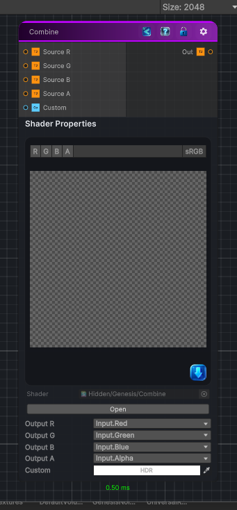

<link rel="stylesheet" href="../_assets/theme.css">

<button type="button" class="genesis-theme-toggle" data-genesis-theme-toggle aria-label="Toggle theme">Dark</button>

---
category: "Operations"
---

# Channel Combine

> Combine up to 4 textures into one, allowing you to choose which channel to write in the output texture.

## Description

Combine up to 4 textures into one, allowing you to choose which channel to write in the output texture.

Note that for creating HDRP Mask and Detail maps, there are dedicated nodes.

## Inputs

| Name | Type | Description |
|------|------|-------------|
| Source R | Texture2D | Source Texture for the R channel |
| Source G | Texture2D | Source Texture for the G channel |
| Source B | Texture2D | Source Texture for the B channel |
| Source A | Texture2D | Source Texture for the A channel |
| Custom | Color |  |

## Outputs

| Name | Type |
|------|------|
| Out | Texture2D |

## Parameters

| Setting | Type | Default | Description |
|---------|------|---------|-------------|
| Output R | Float | 0 | Select which channel from the R input texture to write in the R output channel |
| Output G | Float | 1 | Select which channel from the G input texture to write in the G output channel |
| Output B | Float | 2 | Select which channel from the B input texture to write in the B output channel |
| Output A | Float | 3 | Select which channel from the A input texture to write in the A output channel |
| Custom | Color | (1.0, 1.0, 1.0, 1.0) | Controls the custom. |

## See Also

- [Back to Channel Combine](./operations-index.md)
