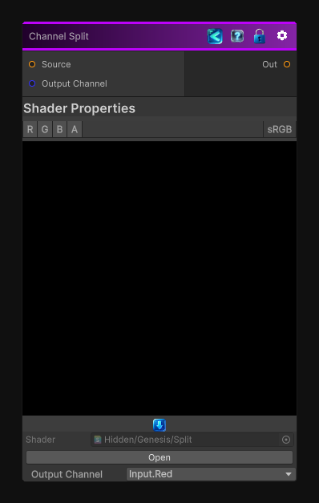

<link rel="stylesheet" href="../_assets/theme.css">

<button type="button" class="genesis-theme-toggle" data-genesis-theme-toggle aria-label="Toggle theme">Dark</button>

---
category: "Operations"
---

# Channel Split

> Return the R, G, B or A channel from an input

## Description

Return the R, G, B or A channel from an input

## Inputs

| Name | Type | Description |
|------|------|-------------|
| Source | Texture2D | Source Texture |
| Output Channel | Single | Select which channel to output |

## Outputs

| Name | Type |
|------|------|
| Out | Texture2D |

## Parameters

| Setting | Type | Default | Description |
|---------|------|---------|-------------|
| Output Channel | Float | 0 | Select which channel to output |

## See Also

- [Back to Channel Split](./operations-index.md)
