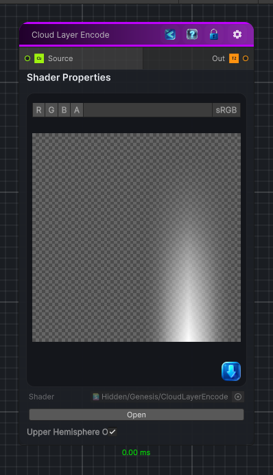

<link rel="stylesheet" href="../_assets/theme.css">

<button type="button" class="genesis-theme-toggle" data-genesis-theme-toggle aria-label="Toggle theme">Dark</button>

---
category: "Operations"
---

# Cloud Layer Encode

> Encodes a Cubemap texture into a 2D map, the output texture is formated for the HDRP cloud layer system (latlong).

## Description

Encodes a Cubemap texture into a 2D map, the output texture is formated for the HDRP cloud layer system (latlong).

## Inputs

| Name | Type | Description |
|------|------|-------------|
| Source | Cubemap |  |

## Outputs

| Name | Type |
|------|------|
| Out | Texture2D |

## Parameters

| Setting | Type | Default | Description |
|---------|------|---------|-------------|
| Source | Cube | white | Controls the source. |
| Upper Hemisphere Only | Toggle | 1 | Is the map encoded for Upper Hemisphere cloud layer setting |

## See Also

- [Back to Cloud Layer Encode](./operations-index.md)
