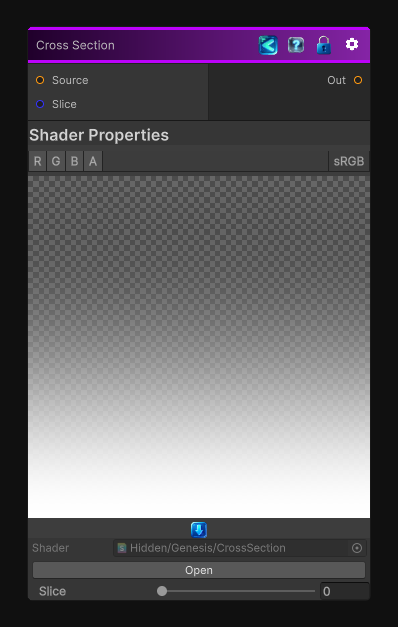

<link rel="stylesheet" href="../_assets/theme.css">

<button type="button" class="genesis-theme-toggle" data-genesis-theme-toggle aria-label="Toggle theme">Dark</button>

---
category: "Operations"
---

# Cross Section

> The cross section node allow you to generate 2D texture by taking either a slice of a texture 2D or 3D.

## Description

The cross section node allow you to generate 2D texture by taking either a slice of a texture 2D or 3D.
Right now this node is limited to slices on the Y axis. 

## Inputs

| Name | Type | Description |
|------|------|-------------|
| Source | Texture2D |  |
| Slice | Single |  |

## Outputs

| Name | Type |
|------|------|
| Out | Texture2D |

## Parameters

| Setting | Type | Default | Description |
|---------|------|---------|-------------|
| Slice | Range | 0 | Slice of the inptu texture in the Y axis, between 0 and 1 |

## See Also

- [Back to Cross Section](./operations-index.md)
