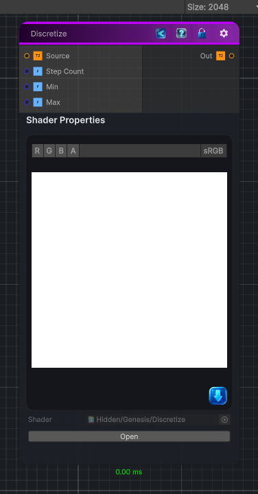

<link rel="stylesheet" href="../_assets/theme.css">

<button type="button" class="genesis-theme-toggle" data-genesis-theme-toggle aria-label="Toggle theme">Dark</button>

---
category: "Operations"
---

# Discretize

> Round the color components to a specified number of steps in the image.

## Description

Round the color components to a specified number of steps in the image.
This node can also be used to make a posterize effect.

By default the input values are considered to be between 0 and 1, you can change these values in the node inspector to adapt the effect to your input data.

## Inputs

| Name | Type | Description |
|------|------|-------------|
| Source | Texture2D |  |
| Step Count | Single |  |
| Min | Single |  |
| Max | Single |  |

## Outputs

| Name | Type |
|------|------|
| Out | Texture2D |

## Parameters

| Setting | Type | Default | Description |
|---------|------|---------|-------------|
| Step Count | Int | 16 | Controls the step count. |
| Min | Float | 0 | Controls the min. |
| Max | Float | 1 | Controls the max. |

## See Also

- [Back to Discretize](./operations-index.md)
