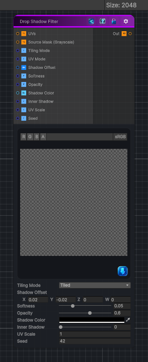

<link rel="stylesheet" href="../_assets/theme.css">

<button type="button" class="genesis-theme-toggle" data-genesis-theme-toggle aria-label="Toggle theme">Dark</button>

---
category: "Operations"
---

# Drop Shadow Filter

> - Creates a soft, directional shadow behind any grayscale mask

## Description

- Creates a soft, directional shadow behind any grayscale mask
- Adjustable offset, softness, opacity, color
- Optional inner shadow mode
- Fully procedural and CRT‑safe

## Inputs

| Name | Type | Description |
|------|------|-------------|
| UVs | Texture2D |  |
| Source Mask (Grayscale) | Texture2D |  |
| Tiling Mode | Single |  |
| UV Mode | Single |  |
| Shadow Offset | Vector4 |  |
| Softness | Single |  |
| Opacity | Single |  |
| Shadow Color | Color |  |
| Inner Shadow | Single |  |
| UV Scale | Single |  |
| Seed | Single |  |

## Outputs

| Name | Type |
|------|------|
| Out | Texture2D |

## Parameters

| Setting | Type | Default | Description |
|---------|------|---------|-------------|
| Source Mask (Grayscale) | 2D | white | Controls the source mask (grayscale). |
| Tiling Mode | Keyword Enum | 1 | Controls the tiling mode. |
| UV Mode | Enum | 0 | Controls the uv mode. |
| Shadow Offset | Vector | (0.02, -0.02, 0, 0) | Controls the shadow offset. |
| Softness | Range | 0.05 | Controls the softness. |
| Opacity | Range | 0.6 | Controls the opacity. |
| Shadow Color | Color | (0,0,0,1) | Controls the shadow color. |
| Inner Shadow | Range | 0 | Controls the inner shadow. |
| UV Scale | Float | 1.0 | Controls the uv scale. |
| Seed | Int | 42 | Controls the seed. |

## See Also

- [Back to Drop Shadow Filter](./operations-index.md)
