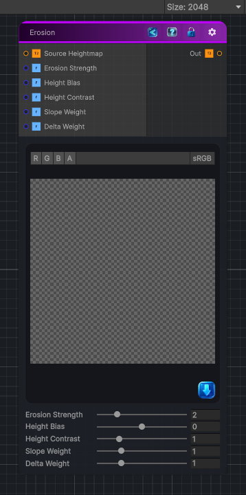

<link rel="stylesheet" href="../_assets/theme.css">

<button type="button" class="genesis-theme-toggle" data-genesis-theme-toggle aria-label="Toggle theme">Dark</button>

---
category: "Operations"
---

# Erosion

> Applies erosion-style wear to the input to help shape weathered heightmaps and natural surface breakup.

## Description

Applies erosion-style wear to the input to help shape weathered heightmaps and natural surface breakup.

## Inputs

| Name | Type | Description |
|------|------|-------------|
| Source Heightmap | Texture2D |  |
| Erosion Strength | Single |  |
| Height Bias | Single |  |
| Height Contrast | Single |  |
| Slope Weight | Single |  |
| Delta Weight | Single |  |

## Outputs

| Name | Type |
|------|------|
| Out | Texture2D |

## Parameters

| Setting | Type | Default | Description |
|---------|------|---------|-------------|
| Source Heightmap | 2D | white | Controls the source heightmap. |
| Erosion Strength | Range | 2.0 | Controls the erosion strength. |
| Height Bias | Range | 0.0 | Controls the height bias. |
| Height Contrast | Range | 1.0 | Controls the height contrast. |
| Slope Weight | Range | 1.0 | Controls the slope weight. |
| Delta Weight | Range | 1.0 | Controls the delta weight. |

## See Also

- [Back to Erosion](./operations-index.md)
