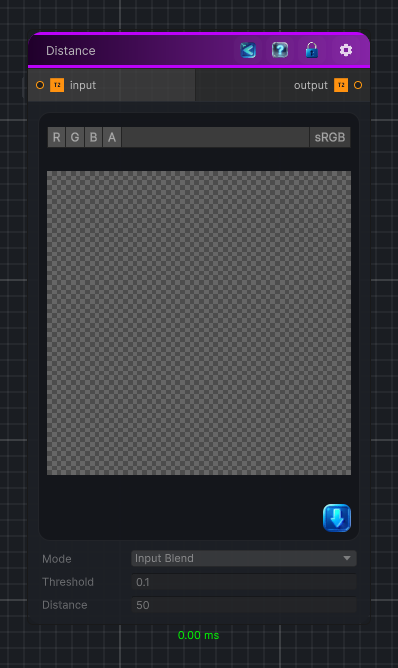

<link rel="stylesheet" href="../_assets/theme.css">

<button type="button" class="genesis-theme-toggle" data-genesis-theme-toggle aria-label="Toggle theme">Dark</button>

---
category: "Operations"
---

# Fill

> Execute a flood fill operation on all pixels above the specified threshold.

## Description

Execute a flood fill operation on all pixels above the specified threshold.

Note that the computational cost of this node only depends on the texture resolution and not the distance parameter.

Smooth is only in alpha

## Inputs

| Name | Type | Description |
|------|------|-------------|
| input | Texture2D |  |

## Outputs

| Name | Type |
|------|------|
| output | Texture2D |

## Parameters

| Setting | Type | Default | Description |
|---------|------|---------|-------------|
| mode | Mode | InputBlend | |
| threshold | Single | 0.1 | |
| thresholdMode | ThresholdMode | Luminance | |
| distance | Single | 50 | |
| distanceMode | DistanceMode | Euclidian | |
| nodeVariables | VariableStorage | AhahGames.GenesisNoise.Graph.VariableStorage | |
| GUID | String | 761de9c5-6257-4a26-bc2f-85fa8780d7df | |
| expanded | Boolean | False | |

## See Also

- [Back to Fill](./operations-index.md)
