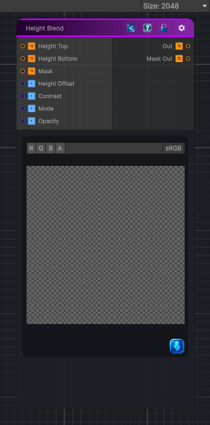

<link rel="stylesheet" href="../_assets/theme.css">

<button type="button" class="genesis-theme-toggle" data-genesis-theme-toggle aria-label="Toggle theme">Dark</button>

---
category: "Operations"
---

# Height Blend

> Combines a top and bottom height map using their height information. An optional

## Description

Combines a top and bottom height map using their height information. An optional
grayscale mask limits the effect.

Outputs:
• Out       — The blended height map
• Mask Out  — The final black-and-white blend mask

Height Offset moves the blend boundary along the height axis. Contrast sharpens
or softens that boundary. Balanced Height allows either layer to shape the result,
while Bottom Height Priority prevents the top layer from lowering the bottom.
Opacity fades the top layer and its generated mask in or out.

## Inputs

| Name | Type | Description |
|------|------|-------------|
| Height Top | Texture2D | Grayscale height map placed on top |
| Height Bottom | Texture2D | Grayscale height map used as the bottom layer |
| Mask | Texture2D | Optional grayscale mask used to limit the blend |
| Height Offset | Single | Moves the blend level along the height axis |
| Contrast | Single | Sharpens the transition between the two height maps |
| Mode | Single | Selects how the two heights contribute to the result |
| Opacity | Single | Fades the foreground height and generated mask in or out |

## Outputs

| Name | Type |
|------|------|
| Mask Out | Texture2D |
| Out | Texture2D |

## Parameters

| Setting | Type | Default | Description |
|---------|------|---------|-------------|
| Height Top | 2D | black | Grayscale height map placed on top |
| Height Bottom | 2D | black | Grayscale height map used as the bottom layer |
| Mask | 2D | white | Optional grayscale mask used to limit the blend |
| Height Offset | Range | 0.5 | Moves the blend level along the height axis |
| Contrast | Range | 0.5 | Sharpens the transition between the two height maps |
| Mode | Enum | 0 | Selects how the two heights contribute to the result |
| Opacity | Range | 1.0 | Fades the foreground height and generated mask in or out |
| Output Mode | Float | 0 | Controls the output mode. |

## See Also

- [Back to Height Blend](./operations-index.md)
