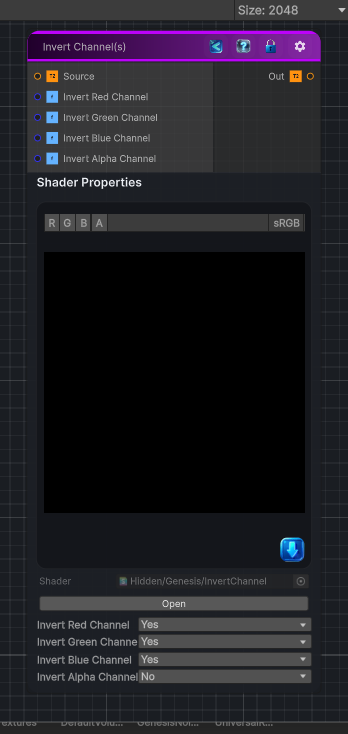

<link rel="stylesheet" href="../_assets/theme.css">

<button type="button" class="genesis-theme-toggle" data-genesis-theme-toggle aria-label="Toggle theme">Dark</button>

---
category: "Operations"
---

# Invert Channel(s)

> Inverts the selected channel(s) of the input texture.

## Description

Inverts the selected channel(s) of the input texture.

## Inputs

| Name | Type | Description |
|------|------|-------------|
| Source | Texture2D |  |
| Invert Red Channel | Single | Invert Red Channel |
| Invert Green Channel | Single | Invert Green Channel |
| Invert Blue Channel | Single | Invert Blue Channel |
| Invert Alpha Channel | Single | Invert Alpha Channel |

## Outputs

| Name | Type |
|------|------|
| Out | Texture2D |

## Parameters

| Setting | Type | Default | Description |
|---------|------|---------|-------------|
| Invert Red Channel | Enum | 1 | Invert Red Channel |
| Invert Green Channel | Enum | 1 | Invert Green Channel |
| Invert Blue Channel | Enum | 1 | Invert Blue Channel |
| Invert Alpha Channel | Enum | 0 | Invert Alpha Channel |

## See Also

- [Back to Invert Channel(s)](./operations-index.md)
