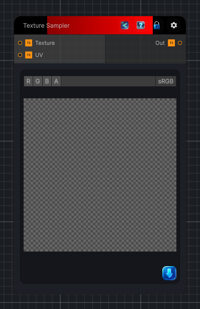

<link rel="stylesheet" href="../_assets/theme.css">

<button type="button" class="genesis-theme-toggle" data-genesis-theme-toggle aria-label="Toggle theme">Dark</button>

---
category: "Operations/Textures"
---

# Texture Sampler

> Sample a texture. Note that you can use a custom UV texture as well.

## Description

Sample a texture. Note that you can use a custom UV texture as well.

## Inputs

| Name | Type | Description |
|------|------|-------------|
| Texture | Texture2D |  |
| UV | Texture2D |  |

## Outputs

| Name | Type |
|------|------|
| Out | Texture2D |

## Parameters

| Setting | Type | Default | Description |
|---------|------|---------|-------------|
| nodeVariables | VariableStorage | AhahGames.GenesisNoise.Graph.VariableStorage | |
| GUID | String | 3ce563b1-58b4-488b-96c1-780d7c451fb9 | |
| expanded | Boolean | False | |

## See Also

- [Back to Texture Sampler](./operations-index.md)
