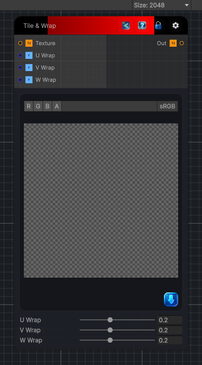

<link rel="stylesheet" href="../_assets/theme.css">

<button type="button" class="genesis-theme-toggle" data-genesis-theme-toggle aria-label="Toggle theme">Dark</button>

---
category: "Operations/Textures"
---

# Tile Wrap

> Make the input texture tile by wrapping and blending the borders of the texture.

## Description

Make the input texture tile by wrapping and blending the borders of the texture.

## Inputs

| Name | Type | Description |
|------|------|-------------|
| Texture | Texture2D |  |
| U Wrap | Single |  |
| V Wrap | Single |  |
| W Wrap | Single |  |

## Outputs

| Name | Type |
|------|------|
| Out | Texture2D |

## Parameters

| Setting | Type | Default | Description |
|---------|------|---------|-------------|
| U Wrap | Range | 0.2 | Controls the u wrap. |
| V Wrap | Range | 0.2 | Controls the v wrap. |
| W Wrap | Range | 0.2 | Controls the w wrap. |

## See Also

- [Back to Tile Wrap](./operations-index.md)
