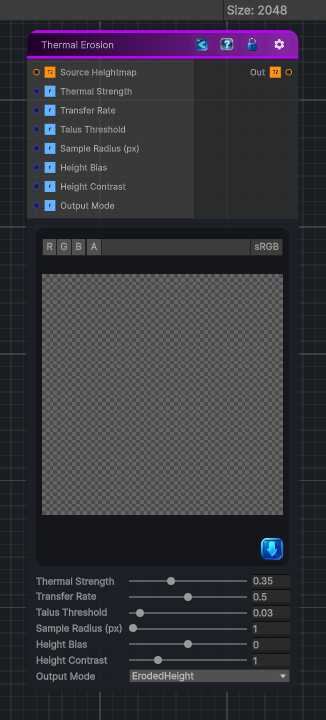

<link rel="stylesheet" href="../_assets/theme.css">

<button type="button" class="genesis-theme-toggle" data-genesis-theme-toggle aria-label="Toggle theme">Dark</button>

---
category: "Operations"
---

# Thermal Erosion

> Applies thermal erosion to a heightmap by transferring material from steep cells to lower neighboring cells.

## Description

Applies thermal erosion to a heightmap by transferring material from steep cells to lower neighboring cells.

Use the talus threshold to control which slopes are considered unstable. The strength and transfer rate control how much material moves per pass, while the output mode can show the eroded height, removed material, deposited material, or local slope.

## Inputs

| Name | Type | Description |
|------|------|-------------|
| Source Heightmap | Texture2D |  |
| Thermal Strength | Single |  |
| Transfer Rate | Single |  |
| Talus Threshold | Single |  |
| Sample Radius (px) | Single |  |
| Height Bias | Single |  |
| Height Contrast | Single |  |
| Output Mode | Single |  |

## Outputs

| Name | Type |
|------|------|
| Out | Texture2D |

## Parameters

| Setting | Type | Default | Description |
|---------|------|---------|-------------|
| Source Heightmap | 2D | white | Controls the source heightmap. |
| Thermal Strength | Range | 0.35 | Controls the thermal strength. |
| Transfer Rate | Range | 0.5 | Controls the transfer rate. |
| Talus Threshold | Range | 0.03 | Controls the talus threshold. |
| Sample Radius (px) | Range | 1 | Controls the sample radius (px). |
| Height Bias | Range | 0.0 | Controls the height bias. |
| Height Contrast | Range | 1.0 | Controls the height contrast. |
| Output Mode | Enum | 0 | Controls the output mode. |

## See Also

- [Back to Thermal Erosion](./operations-index.md)
