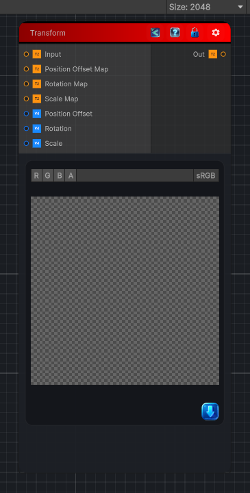

<link rel="stylesheet" href="../_assets/theme.css">

<button type="button" class="genesis-theme-toggle" data-genesis-theme-toggle aria-label="Toggle theme">Dark</button>

---
category: "Operations"
---

# Transform

> Apply a transformation on the input texture. This node allows you to offset, scale and rotate the input texture based on either another texture or a constant.

## Description

Apply a transformation on the input texture. This node allows you to offset, scale and rotate the input texture based on either another texture or a constant.

Note that the values from the rotation map will be converted to euler angles in the node so that 1 means 360 degree. 

## Inputs

| Name | Type | Description |
|------|------|-------------|
| Input | Texture2D |  |
| Position Offset Map | Texture2D |  |
| Rotation Map | Texture2D | The rotation is stored in the X, Y and Z channels. A value of 1 means 360 degree. |
| Scale Map | Texture2D |  |
| Position Offset | Vector4 |  |
| Rotation | Vector4 | Rotation in euler angles between 0 and 360 |
| Scale | Vector4 |  |

## Outputs

| Name | Type |
|------|------|
| Out | Texture2D |

## Parameters

| Setting | Type | Default | Description |
|---------|------|---------|-------------|
| Position Offset | Vector | (0, 0, 0, 0) | Controls the position offset. |
| Rotation | Vector | (0, 0, 0, 0) | Rotation in euler angles between 0 and 360 |
| Scale | Vector | (1, 1, 1, 1) | Controls the scale. |

## See Also

- [Back to Transform](./operations-index.md)
