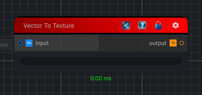

<link rel="stylesheet" href="../_assets/theme.css">

<button type="button" class="genesis-theme-toggle" data-genesis-theme-toggle aria-label="Toggle theme">Dark</button>

---
category: "Operations"
---

# Vector To Texture

> Converts vector data into a texture representation.

## Description

Converts vector data into a texture representation.

## Inputs

| Name | Type | Description |
|------|------|-------------|
| input | Vector4 |  |

## Outputs

| Name | Type |
|------|------|
| output | Texture2D |

## Parameters

| Setting | Type | Default | Description |
|---------|------|---------|-------------|
| nodeVariables | VariableStorage | AhahGames.GenesisNoise.Graph.VariableStorage | |
| GUID | String | 8c0386a7-57ee-4bb9-ad33-b18e002c70da | |
| expanded | Boolean | False | |

## See Also

- [Back to Vector To Texture](./operations-index.md)
