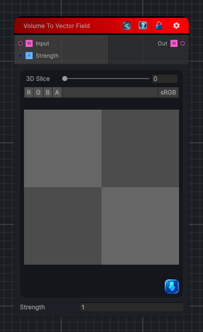

<link rel="stylesheet" href="../_assets/theme.css">

<button type="button" class="genesis-theme-toggle" data-genesis-theme-toggle aria-label="Toggle theme">Dark</button>

---
category: "Operations"
---

# Volume To Vector Field

> Converts a volume input into a vector field texture.

## Description

Converts a volume input into a vector field texture.

## Inputs

| Name | Type | Description |
|------|------|-------------|
| Input | Texture3D |  |
| Strength | Single |  |

## Outputs

| Name | Type |
|------|------|
| Out | Texture3D |

## Parameters

| Setting | Type | Default | Description |
|---------|------|---------|-------------|
| Strength | Float | 1 | Controls the strength. |

## See Also

- [Back to Volume To Vector Field](./operations-index.md)
