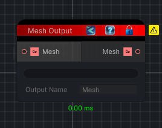

<link rel="stylesheet" href="../_assets/theme.css">

<button type="button" class="genesis-theme-toggle" data-genesis-theme-toggle aria-label="Toggle theme">Dark</button>

---
category: "Output"
---

# Mesh Output

> Serializes a mesh from the graph as a graph sub-asset so it can be reused by Blueprint Nodes in other graphs.

## Description

Serializes a mesh from the graph as a graph sub-asset so it can be reused by Blueprint Nodes in other graphs.

## Inputs

| Name | Type | Description |
|------|------|-------------|
| Mesh | GameObject |  |

## Outputs

| Name | Type |
|------|------|
| Mesh | GameObject |

## Parameters

| Setting | Type | Default | Description |
|---------|------|---------|-------------|
| nodeVariables | VariableStorage | AhahGames.GenesisNoise.Graph.VariableStorage | |
| GUID | String | e9c8059b-14b6-498e-a544-0289ce516755 | |
| expanded | Boolean | False | |

## See Also

- [Back to Mesh Output](./output-index.md)
