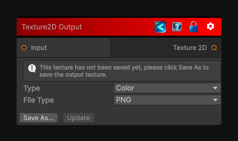

<link rel="stylesheet" href="../_assets/theme.css">

<button type="button" class="genesis-theme-toggle" data-genesis-theme-toggle aria-label="Toggle theme">Dark</button>

---
category: "Output"
---

# Texture 2D

> Writes the graph result to a 2D texture output.

## Description

Writes the graph result to a 2D texture output.

## Inputs

| Name | Type | Description |
|------|------|-------------|

## Outputs

| Name | Type |
|------|------|

## Parameters

| Setting | Type | Default | Description |
|---------|------|---------|-------------|
| asset | Texture | — | |
| wrapMode | TextureWrapMode | Repeat | |
| filterMode | FilterMode | Bilinear | |
| hasMipMaps | Boolean | False | |
| nodeVariables | VariableStorage | AhahGames.GenesisNoise.Graph.VariableStorage | |
| GUID | String | 8f8536ab-4e13-4c00-bb72-cfeea3f1b4a9 | |
| expanded | Boolean | False | |

## See Also

- [Back to Texture 2D](./output-index.md)
