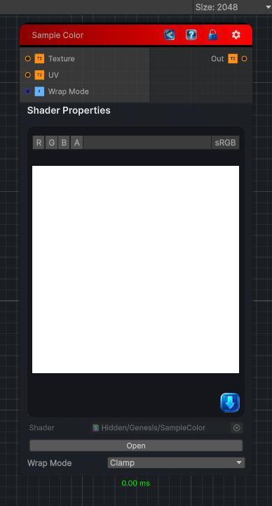

<link rel="stylesheet" href="../_assets/theme.css">

<button type="button" class="genesis-theme-toggle" data-genesis-theme-toggle aria-label="Toggle theme">Dark</button>

---
category: "Sampler"
---

# Sample Color

> Samples an RGBA color from an input texture at the given UV coordinates.

## Description

Samples an RGBA color from an input texture at the given UV coordinates.
Equivalent to Substance Designer's Sample Color node.

## Inputs

| Name | Type | Description |
|------|------|-------------|
| Texture | Texture2D |  |
| UV | Texture2D |  |
| Wrap Mode | Single | Wrap mode for UV coordinates. |

## Outputs

| Name | Type |
|------|------|
| Out | Texture2D |

## Parameters

| Setting | Type | Default | Description |
|---------|------|---------|-------------|
| Wrap Mode | Enum | 0 | Wrap mode for UV coordinates. |

## See Also

- [Back to Sample Color](./sampler-index.md)
