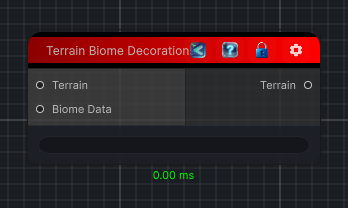

<link rel="stylesheet" href="../_assets/theme.css">

<button type="button" class="genesis-theme-toggle" data-genesis-theme-toggle aria-label="Toggle theme">Dark</button>

---
category: "Terrain/Biome"
---

# Apply Decorations

## Description

_No description available._

## Inputs

| Name | Type | Description |
|------|------|-------------|
| Biome Data | BiomeData |  |
| Terrain | Terrain |  |

## Outputs

| Name | Type |
|------|------|
| Terrain | Terrain |

## Parameters

| Setting | Type | Default | Description |
|---------|------|---------|-------------|
| nodeVariables | VariableStorage | AhahGames.GenesisNoise.Graph.VariableStorage | |
| GUID | String | d92b4e95-da63-4e05-80a3-b32bb4391f89 | |
| expanded | Boolean | False | |

## See Also

- [Back to Apply Decorations](./terrain-index.md)
