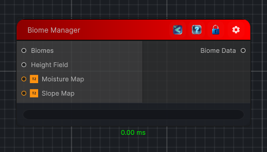

<link rel="stylesheet" href="../_assets/theme.css">

<button type="button" class="genesis-theme-toggle" data-genesis-theme-toggle aria-label="Toggle theme">Dark</button>

---
category: "Terrain/Biome"
---

# Biome Manager

## Description

_No description available._

## Inputs

| Name | Type | Description |
|------|------|-------------|
| Slope Map | Texture2D |  |
| Moisture Map | Texture2D |  |
| Height Field | HeightField |  |
| Biomes | IList`1 |  |

## Outputs

| Name | Type |
|------|------|
| Biome Data | BiomeData |

## Parameters

| Setting | Type | Default | Description |
|---------|------|---------|-------------|
| nodeVariables | VariableStorage | AhahGames.GenesisNoise.Graph.VariableStorage | |
| GUID | String | 90742bce-42f6-4179-8089-225c79a21431 | |
| expanded | Boolean | False | |

## See Also

- [Back to Biome Manager](./terrain-index.md)
