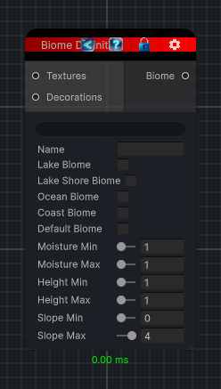

<link rel="stylesheet" href="../_assets/theme.css">

<button type="button" class="genesis-theme-toggle" data-genesis-theme-toggle aria-label="Toggle theme">Dark</button>

---
category: "Terrain/Biome"
---

# Biome

## Description

_No description available._

## Inputs

| Name | Type | Description |
|------|------|-------------|
| Decorations | List`1 |  |
| Textures | List`1 |  |

## Outputs

| Name | Type |
|------|------|
| Biome | Biome |

## Parameters

| Setting | Type | Default | Description |
|---------|------|---------|-------------|
| nodeVariables | VariableStorage | AhahGames.GenesisNoise.Graph.VariableStorage | |
| GUID | String | d679cc09-be0a-4d7d-8aa7-2d608e1b038f | |
| expanded | Boolean | False | |

## See Also

- [Back to Biome](./terrain-index.md)
