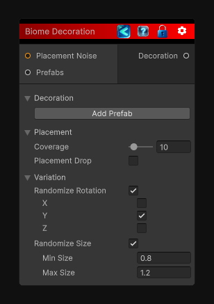

<link rel="stylesheet" href="../_assets/theme.css">

<button type="button" class="genesis-theme-toggle" data-genesis-theme-toggle aria-label="Toggle theme">Dark</button>

---
category: "Terrain/Biome"
---

# Decoration

## Description

_No description available._

## Inputs

| Name | Type | Description |
|------|------|-------------|

## Outputs

| Name | Type |
|------|------|

## Parameters

| Setting | Type | Default | Description |
|---------|------|---------|-------------|
| nodeVariables | VariableStorage | AhahGames.GenesisNoise.Graph.VariableStorage | |
| GUID | String | 3ebb5535-9059-4353-8eee-6919ad2f6e56 | |
| expanded | Boolean | False | |

## See Also

- [Back to Decoration](./terrain-index.md)
