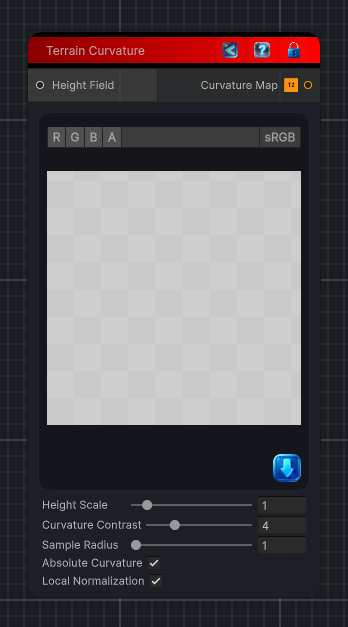

<link rel="stylesheet" href="../_assets/theme.css">

<button type="button" class="genesis-theme-toggle" data-genesis-theme-toggle aria-label="Toggle theme">Dark</button>

---
category: "Terrain/Data"
---

# Curvature

> Creates a visible grayscale curvature map from a heightfield. Absolute mode writes black for flat areas and white for stronger local curvature; signed mode uses gray for flat, white for ridges, and black for bowls.

## Description

Creates a visible grayscale curvature map from a heightfield. Absolute mode writes black for flat areas and white for stronger local curvature; signed mode uses gray for flat, white for ridges, and black for bowls.

## Inputs

| Name | Type | Description |
|------|------|-------------|
| Height Field | HeightField |  |

## Outputs

| Name | Type |
|------|------|
| Curvature Map | Texture2D |

## Parameters

| Setting | Type | Default | Description |
|---------|------|---------|-------------|
| nodeVariables | VariableStorage | AhahGames.GenesisNoise.Graph.VariableStorage | |
| GUID | String | 41fd1241-3603-4624-a63e-0ba76e4643f2 | |
| expanded | Boolean | False | |

## See Also

- [Back to Curvature](./terrain-index.md)
