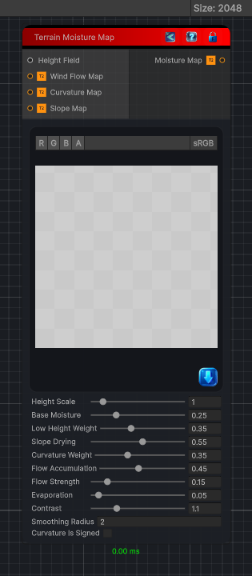

<link rel="stylesheet" href="../_assets/theme.css">

<button type="button" class="genesis-theme-toggle" data-genesis-theme-toggle aria-label="Toggle theme">Dark</button>

---
category: "Terrain/Data"
---

# Moisture Map

> Creates a grayscale terrain moisture map from height, wind flow, curvature, and slope maps. Black is dry and white is wet.

## Description

Creates a grayscale terrain moisture map from height, wind flow, curvature, and slope maps. Black is dry and white is wet.

## Inputs

| Name | Type | Description |
|------|------|-------------|
| Slope Map | Texture2D |  |
| Curvature Map | Texture2D |  |
| Wind Flow Map | Texture2D |  |
| Height Field | HeightField |  |

## Outputs

| Name | Type |
|------|------|
| Moisture Map | Texture2D |

## Parameters

| Setting | Type | Default | Description |
|---------|------|---------|-------------|
| nodeVariables | VariableStorage | AhahGames.GenesisNoise.Graph.VariableStorage | |
| GUID | String | 5e9c3352-e71c-4367-aa5e-56f9febf28a6 | |
| expanded | Boolean | False | |

## See Also

- [Back to Moisture Map](./terrain-index.md)
