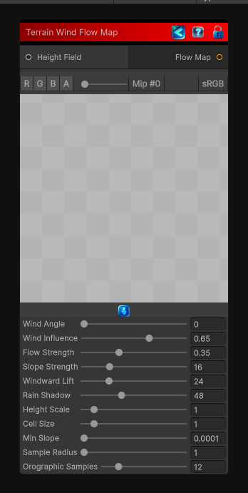

<link rel="stylesheet" href="../_assets/theme.css">

<button type="button" class="genesis-theme-toggle" data-genesis-theme-toggle aria-label="Toggle theme">Dark</button>

---
category: "Terrain/Data"
---

# Wind Flow Map

> Creates a wind flow map from a heightfield. Red and green encode flow direction, blue encodes flow strength, and alpha is one.

## Description

Creates a wind flow map from a heightfield. Red and green encode flow direction, blue encodes flow strength, and alpha is one.

## Inputs

| Name | Type | Description |
|------|------|-------------|
| Height Field | HeightField |  |

## Outputs

| Name | Type |
|------|------|
| Flow Map | Texture2D |

## Parameters

| Setting | Type | Default | Description |
|---------|------|---------|-------------|
| nodeVariables | VariableStorage | AhahGames.GenesisNoise.Graph.VariableStorage | |
| GUID | String | c420d505-b88d-4529-be49-7ff9a64ccd63 | |
| expanded | Boolean | False | |

## See Also

- [Back to Wind Flow Map](./terrain-index.md)
