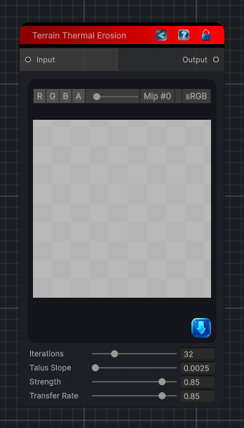

<link rel="stylesheet" href="../_assets/theme.css">

<button type="button" class="genesis-theme-toggle" data-genesis-theme-toggle aria-label="Toggle theme">Dark</button>

---
category: "Terrain/Erosion"
---

# Thermal Erosion

> Applies thermal erosion to a heightfield by moving loose material from slopes above a talus threshold into lower neighboring cells.

## Description

Applies thermal erosion to a heightfield by moving loose material from slopes above a talus threshold into lower neighboring cells.

## Inputs

| Name | Type | Description |
|------|------|-------------|
| Input | HeightField |  |

## Outputs

| Name | Type |
|------|------|
| Output | HeightField |

## Parameters

| Setting | Type | Default | Description |
|---------|------|---------|-------------|
| nodeVariables | VariableStorage | AhahGames.GenesisNoise.Graph.VariableStorage | |
| GUID | String | 5b742c11-e76b-41e3-a024-2bae6d510518 | |
| expanded | Boolean | False | |

## See Also

- [Back to Thermal Erosion](./terrain-index.md)
