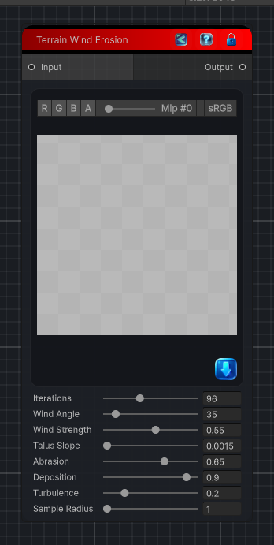

<link rel="stylesheet" href="../_assets/theme.css">

<button type="button" class="genesis-theme-toggle" data-genesis-theme-toggle aria-label="Toggle theme">Dark</button>

---
category: "Terrain/Erosion"
---

# Wind Erosion

> Applies directional wind erosion to a heightfield by transporting loose material downwind, abrading exposed slopes, and depositing sediment in sheltered cells.

## Description

Applies directional wind erosion to a heightfield by transporting loose material downwind, abrading exposed slopes, and depositing sediment in sheltered cells.

## Inputs

| Name | Type | Description |
|------|------|-------------|
| Input | HeightField |  |

## Outputs

| Name | Type |
|------|------|
| Output | HeightField |

## Parameters

| Setting | Type | Default | Description |
|---------|------|---------|-------------|
| nodeVariables | VariableStorage | AhahGames.GenesisNoise.Graph.VariableStorage | |
| GUID | String | 43c162df-7d95-429b-ba6f-80ef22392d56 | |
| expanded | Boolean | False | |

## See Also

- [Back to Wind Erosion](./terrain-index.md)
