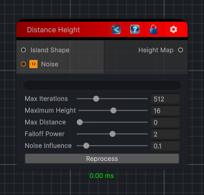

<link rel="stylesheet" href="../_assets/theme.css">

<button type="button" class="genesis-theme-toggle" data-genesis-theme-toggle aria-label="Toggle theme">Dark</button>

---
category: "Terrain/Height"
---

# Distance-Noise Height

## Description

_No description available._

## Inputs

| Name | Type | Description |
|------|------|-------------|
| Noise | Texture2D |  |
| Island Shape | IslandShape |  |

## Outputs

| Name | Type |
|------|------|
| Height Map | HeightField |

## Parameters

| Setting | Type | Default | Description |
|---------|------|---------|-------------|
| heightmapRT | RenderTexture | — | |
| previewRT | RenderTexture | — | |
| nodeVariables | VariableStorage | AhahGames.GenesisNoise.Graph.VariableStorage | |
| GUID | String | 6a8e3ed1-e793-4a13-a6ed-469ce1e1a041 | |
| expanded | Boolean | False | |

## See Also

- [Back to Distance-Noise Height](./terrain-index.md)
