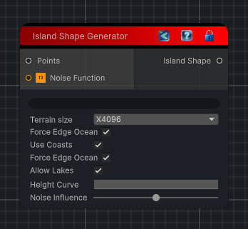

<link rel="stylesheet" href="../_assets/theme.css">

<button type="button" class="genesis-theme-toggle" data-genesis-theme-toggle aria-label="Toggle theme">Dark</button>

---
category: "Terrain/Shape"
---

# Island Generator

## Description

_No description available._

## Inputs

| Name | Type | Description |
|------|------|-------------|

## Outputs

| Name | Type |
|------|------|

## Parameters

| Setting | Type | Default | Description |
|---------|------|---------|-------------|
| TerrainSize | eTerrainSize | x4096 | |
| useCoasts | Boolean | True | |
| forceEdgeOcean | Boolean | True | |
| heightCurve | AnimationCurve | — | |
| noiseInfluence | Single | 0.5 | |
| allowLakes | Boolean | True | |
| nodeVariables | VariableStorage | AhahGames.GenesisNoise.Graph.VariableStorage | |
| GUID | String | ed14d020-ea8b-41ab-bb2f-cef967883c6f | |
| expanded | Boolean | False | |

## See Also

- [Back to Island Generator](./terrain-index.md)
