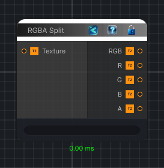

<link rel="stylesheet" href="../_assets/theme.css">

<button type="button" class="genesis-theme-toggle" data-genesis-theme-toggle aria-label="Toggle theme">Dark</button>

---
category: "Texture"
---

# RGBA Split

> Splits a texture into combined RGB and individual R, G, B, and A texture outputs. Individual channels are exposed as grayscale textures.

## Description

Splits a texture into combined RGB and individual R, G, B, and A texture outputs. Individual channels are exposed as grayscale textures.

## Inputs

| Name | Type | Description |
|------|------|-------------|
| Texture | Texture2D |  |

## Outputs

| Name | Type |
|------|------|
| A | Texture2D |
| B | Texture2D |
| G | Texture2D |
| R | Texture2D |
| RGB | Texture2D |

## Parameters

| Setting | Type | Default | Description |
|---------|------|---------|-------------|
| nodeVariables | VariableStorage | AhahGames.GenesisNoise.Graph.VariableStorage | |
| GUID | String | bfb06610-d660-41d7-966a-748b100543c9 | |
| expanded | Boolean | False | |

## See Also

- [Back to RGBA Split](./texture-index.md)
