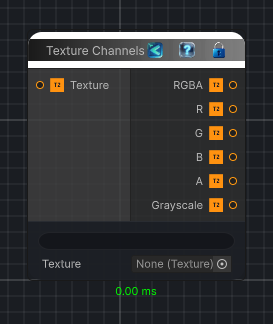

<link rel="stylesheet" href="../_assets/theme.css">

<button type="button" class="genesis-theme-toggle" data-genesis-theme-toggle aria-label="Toggle theme">Dark</button>

---
category: "Texture"
---

# Texture Channels

> Wraps a texture asset or input texture and exposes the source texture's full RGBA color plus its red, green, blue, alpha, and grayscale values as separate outputs.

## Description

Wraps a texture asset or input texture and exposes the source texture's full RGBA color plus its red, green, blue, alpha, and grayscale values as separate outputs.

## Inputs

| Name | Type | Description |
|------|------|-------------|
| Texture | Texture2D |  |

## Outputs

| Name | Type |
|------|------|
| Grayscale | Texture2D |
| A | Texture2D |
| B | Texture2D |
| G | Texture2D |
| R | Texture2D |
| RGBA | Texture2D |

## Parameters

| Setting | Type | Default | Description |
|---------|------|---------|-------------|
| nodeVariables | VariableStorage | AhahGames.GenesisNoise.Graph.VariableStorage | |
| GUID | String | 71475ac3-0f9b-4473-921e-8b955ae54542 | |
| expanded | Boolean | False | |

## See Also

- [Back to Texture Channels](./texture-index.md)
