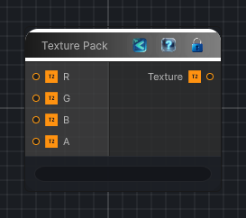

<link rel="stylesheet" href="../_assets/theme.css">

<button type="button" class="genesis-theme-toggle" data-genesis-theme-toggle aria-label="Toggle theme">Dark</button>

---
category: "Texture"
---

# Texture Pack

> Packs four texture inputs into a single RGBA texture. Each input contributes its red channel to the corresponding output channel.

## Description

Packs four texture inputs into a single RGBA texture. Each input contributes its red channel to the corresponding output channel.

## Inputs

| Name | Type | Description |
|------|------|-------------|
| A | Texture2D |  |
| B | Texture2D |  |
| G | Texture2D |  |
| R | Texture2D |  |

## Outputs

| Name | Type |
|------|------|
| Texture | Texture2D |

## Parameters

| Setting | Type | Default | Description |
|---------|------|---------|-------------|
| nodeVariables | VariableStorage | AhahGames.GenesisNoise.Graph.VariableStorage | |
| GUID | String | 99aabd4c-499a-46c5-aa2c-8ad9df9c2056 | |
| expanded | Boolean | False | |

## See Also

- [Back to Texture Pack](./texture-index.md)
