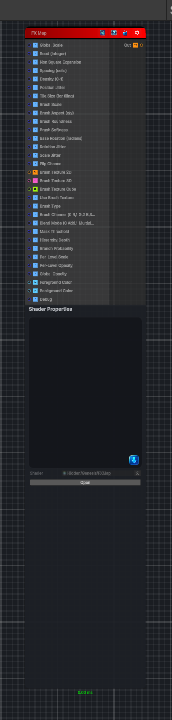

<link rel="stylesheet" href="../_assets/theme.css">

<button type="button" class="genesis-theme-toggle" data-genesis-theme-toggle aria-label="Toggle theme">Dark</button>

---
category: "Tiling"
---

# FX Map

> FX Map node behavior: it scatters oriented brush/shape stamps across the surface with controls for scale, spacing, rotation, jitter, density, brush shape, and layering, plus debug outputs (raw points, mask, orientation, shaded). It is deterministic, sampler‑free, CRT‑safe, supports non‑square compensation, and includes a tiling‑safe seed option pattern you can adapt.

## Description

FX Map node behavior: it scatters oriented brush/shape stamps across the surface with controls for scale, spacing, rotation, jitter, density, brush shape, and layering, plus debug outputs (raw points, mask, orientation, shaded). It is deterministic, sampler‑free, CRT‑safe, supports non‑square compensation, and includes a tiling‑safe seed option pattern you can adapt.

## Inputs

| Name | Type | Description |
|------|------|-------------|
| Global Scale | Single |  |
| Seed (integer) | Single |  |
| Non Square Expansion | Single |  |
| Spacing (cells) | Single |  |
| Density (0-1) | Single |  |
| Position Jitter | Single |  |
| Tile Size (for tiling) | Single |  |
| Brush Scale | Single |  |
| Brush Aspect (x/y) | Single |  |
| Brush Roundness | Single |  |
| Brush Softness | Single |  |
| Base Rotation (radians) | Single |  |
| Rotation Jitter | Single |  |
| Scale Jitter | Single |  |
| Flip Chance | Single |  |
| Brush Texture 2D | Texture2D |  |
| Brush Texture 3D | Texture3D |  |
| Brush Texture Cube | Cubemap |  |
| Use Brush Texture | Single |  |
| Brush Type | Single |  |
| Brush Channel (0 R,1 G,2 B,3 A) | Single |  |
| Blend Mode (0 Add,1 Multiply,2 Max) | Single |  |
| Mask Threshold | Single |  |
| Hierarchy Depth | Single |  |
| Branch Probability | Single |  |
| Per-Level Scale | Single |  |
| Per-Level Opacity | Single |  |
| Global Opacity | Single |  |
| Foreground Color | Color |  |
| Background Color | Color |  |
| Debug | Single |  |

## Outputs

| Name | Type |
|------|------|
| Out | Texture2D |

## Parameters

| Setting | Type | Default | Description |
|---------|------|---------|-------------|
| Global Scale | Float | 4.0 | Controls the global scale. |
| Seed (integer) | Float | 0.0 | Controls the seed (integer). |
| Non Square Expansion | Float | 0.0 | Controls the non square expansion. |
| Spacing (cells) | Float | 6.0 | Controls the spacing (cells). |
| Density (0-1) | Range | 0.85 | Controls the density (0-1). |
| Position Jitter | Range | 0.45 | Controls the position jitter. |
| Tile Size (for tiling) | Float | 0.0 | Controls the tile size (for tiling). |
| Brush Scale | Float | 1.0 | Controls the brush scale. |
| Brush Aspect (x/y) | Range | 1.6 | Controls the brush aspect (x/y). |
| Brush Roundness | Range | 1.0 | Controls the brush roundness. |
| Brush Softness | Range | 0.35 | Controls the brush softness. |
| Base Rotation (radians) | Float | 0.0 | Controls the base rotation (radians). |
| Rotation Jitter | Range | 0.8 | Controls the rotation jitter. |
| Scale Jitter | Range | 0.25 | Controls the scale jitter. |
| Flip Chance | Range | 0.15 | Controls the flip chance. |
| Brush Texture 2D | 2D | white | Controls the brush texture 2d. |
| Brush Texture 3D | 3D | — | Controls the brush texture 3d. |
| Brush Texture Cube | Cube | — | Controls the brush texture cube. |
| Use Brush Texture | Range | 1.0 | Controls the use brush texture. |
| Brush Type | Enum | 0 | Controls the brush type. |
| Brush Channel (0 R,1 G,2 B,3 A) | Range | 3 | Controls the brush channel (0 r,1 g,2 b,3 a). |
| Blend Mode (0 Add,1 Multiply,2 Max) | Range | 0 | Controls the blend mode (0 add,1 multiply,2 max). |
| Mask Threshold | Range | 0.5 | Controls the mask threshold. |
| Hierarchy Depth | Int Range | 1 | Controls the hierarchy depth. |
| Branch Probability | Range | 1 | Controls the branch probability. |
| Per-Level Scale | Range | .5 | Controls the per-level scale. |
| Per-Level Opacity | Range | .75 | Controls the per-level opacity. |
| Global Opacity | Range | 1 | Controls the global opacity. |
| Foreground Color | Color | (1,1,1,1) | Controls the foreground color. |
| Background Color | Color | (0,0,0,1) | Controls the background color. |
| Debug | Enum | 4 | Controls the debug. |

## See Also

- [Back to FX Map](./tiling-index.md)
