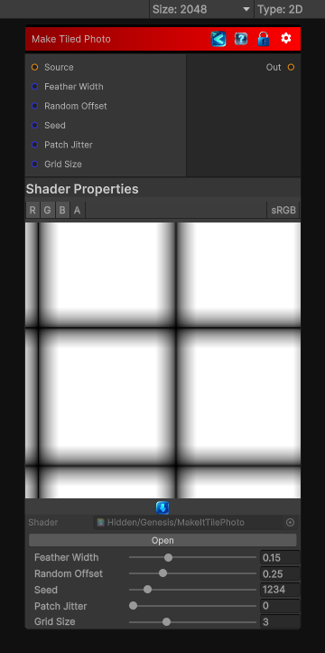

<link rel="stylesheet" href="../_assets/theme.css">

<button type="button" class="genesis-theme-toggle" data-genesis-theme-toggle aria-label="Toggle theme">Dark</button>

---
category: "Tiling"
---

# Make Tiled Photo

> Ot’s more advanced than Make Tiled because it performs:

## Description

Ot’s more advanced than Make Tiled because it performs:
✔ Multi‑directional edge analysis
✔ Seam removal using mirrored borders
✔ Gradient‑domain blending
✔ Optional random offset
✔ Optional patch‑based jitter
✔ Fully seamless output even for photographic sources
- Mirrors the image at borders
- Blends seams using a gradient‑domain feather
- Supports random offset
- Supports patch jitter
- Is deterministic and CRT‑safe

## Inputs

| Name | Type | Description |
|------|------|-------------|

## Outputs

| Name | Type |
|------|------|

## Parameters

| Setting | Type | Default | Description |
|---------|------|---------|-------------|
| Feather Width | Range | 0.15 | Controls the feather width. |
| Random Offset | Range | 0.25 | Controls the random offset. |
| Seed | Range | 1234 | Controls the seed. |
| Patch Jitter | Range | 0.0 | Controls the patch jitter. |
| Grid Size | Range | 3 | Controls the grid size. |

## See Also

- [Back to Make Tiled Photo](./tiling-index.md)
