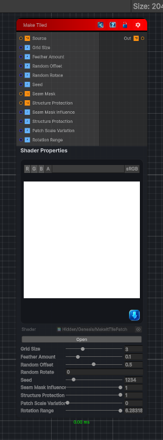

<link rel="stylesheet" href="../_assets/theme.css">

<button type="button" class="genesis-theme-toggle" data-genesis-theme-toggle aria-label="Toggle theme">Dark</button>

---
category: "Tiling"
---

# Make Tiled

> It works by:

## Description

It works by:
- Cutting the input into patches
- Offsetting them in a grid
- Blending the seams using feathering
- Optionally randomizing rotation/flip
- Producing a perfectly tileable output
✔ Patch grid (NxN)
✔ Random offsets per patch
✔ Optional rotation/flip
✔ Seam feathering
✔ Deterministic sampling
✔ CRT‑safe, no derivatives

## Inputs

| Name | Type | Description |
|------|------|-------------|
| Source | Texture2D |  |
| Grid Size | Single |  |
| Feather Amount | Single |  |
| Random Offset | Single |  |
| Random Rotate | Single |  |
| Seed | Single |  |
| Seam Mask | Texture2D |  |
| Structure Protection | Texture2D |  |
| Seam Mask Influence | Single |  |
| Structure Protection | Single |  |
| Patch Scale Variation | Single |  |
| Rotation Range | Single |  |

## Outputs

| Name | Type |
|------|------|
| Out | Texture2D |

## Parameters

| Setting | Type | Default | Description |
|---------|------|---------|-------------|
| Grid Size | Range | 3 | Controls the grid size. |
| Feather Amount | Range | 0.1 | Controls the feather amount. |
| Random Offset | Range | 0.5 | Controls the random offset. |
| Random Rotate | Int | 0 | Controls the random rotate. |
| Seed | Range | 1234 | Controls the seed. |
| Seam Mask Influence | Range | 1 | Controls the seam mask influence. |
| Structure Protection | Range | 1 | Controls the structure protection. |
| Patch Scale Variation | Range | 0 | Controls the patch scale variation. |
| Rotation Range | Range | 6.28318 | Controls the rotation range. |

## See Also

- [Back to Make Tiled](./tiling-index.md)
