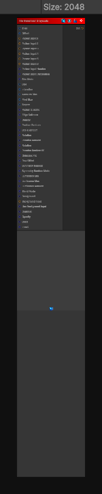

<link rel="stylesheet" href="../_assets/theme.css">

<button type="button" class="genesis-theme-toggle" data-genesis-theme-toggle aria-label="Toggle theme">Dark</button>

---
category: "Tiling"
---

# Tile Generator Grayscale

> Generates Substance-style grayscale tile patterns with image/procedural pattern modes,

## Description

Generates Substance-style grayscale tile patterns with image/procedural pattern modes,
size modes (Interstice/Size/Keep Ratio/Absolute/Pixel), and per-tile variation controls.
Pattern and background texture inputs are converted to grayscale automatically.

## Inputs

| Name | Type | Description |
|------|------|-------------|

## Outputs

| Name | Type |
|------|------|

## Parameters

| Setting | Type | Default | Description |
|---------|------|---------|-------------|
| Tiles | Vector | (8, 8, 0, 0) | Number of tile cells in X and Y |
| Offset | Vector | (0, 0, 0, 0) | Global UV offset |
| Pattern | Float | 0 | Controls the pattern. |
| Pattern Input Number | Int Range | 1 | Number of image inputs used when Pattern is Image Input |
| Pattern Input Distribution | Enum | 0 | Controls the pattern input distribution. |
| Size Mode | Enum | 1 | Controls the size mode. |
| Size | Vector | (0.85, 0.85, 0, 0) | Used by Normal Size and Keep Ratio modes |
| Interstice | Vector | (0.1, 0.1, 0, 0) | Used by Interstice mode |
| Absolute Size | Vector | (0.12, 0.12, 0, 0) | Used by Absolute mode (UV space) |
| Pixel Size | Vector | (64, 64, 0, 0) | Used by Pixel mode (pixels) |
| Aspect | Vector | (1, 1, 0, 0) | Shape width and height aspect |
| Pattern Specific | Range | 0.5 | Pattern specific shape control |
| Edge Softness | Range | 0.03 | Softness of tile edges |
| Density | Range | 1 | Chance that a tile is present |
| Position Random | Range | 0 | Random position offset inside each cell |
| Scale Random | Range | 0 | Random scale variation |
| Rotation | Range | 0 | Base rotation in radians |
| Rotation Random | Range | 0 | Random rotation amount in radians |
| Rotation | Enum | 0 | Controls the rotation. |
| Rotation Random 90 | Range | 0 | Randomly rotates a tile by one of four 90 degree steps |
| Quincunx Flip | Toggle | 0 | Controls the quincunx flip. |
| Row Offset | Range | 0 | Alternating row offset. 0.5 gives classic brick rows. |
| Symmetry Random | Range | 0 | Randomly mirrors tiles |
| Symmetry Random Mode | Enum | 0 | Controls the symmetry random mode. |
| Luminance Min | Range | 0.35 | Minimum grayscale value for tiles |
| Luminance Max | Range | 1 | Maximum grayscale value for tiles |
| Luminance Random | Range | 1 | Random luminance variation between min and max |
| Blend Mode | Enum | 0 | Controls the blend mode. |
| Background | Range | 0 | Background grayscale value |
| Use Background Input | Toggle | 0 | Controls the use background input. |
| Contrast | Range | 1 | Final contrast around mid gray |
| Opacity | Range | 1 | Final output opacity over background |
| Seed | Float | 1 | Random seed |
| Invert | Toggle | 0 | Controls the invert. |

## See Also

- [Back to Tile Generator Grayscale](./tiling-index.md)
