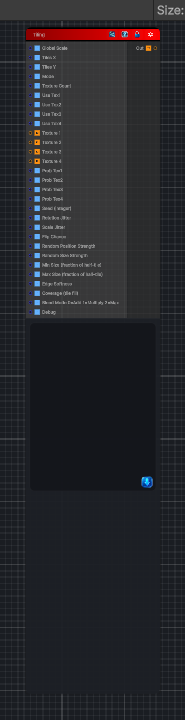

<link rel="stylesheet" href="../_assets/theme.css">

<button type="button" class="genesis-theme-toggle" data-genesis-theme-toggle aria-label="Toggle theme">Dark</button>

---
category: "Tiling"
---

# Tile Random

> Tile a texture, both straight tiling or stochastic

## Description

Tile a texture, both straight tiling or stochastic

## Inputs

| Name | Type | Description |
|------|------|-------------|
| Global Scale | Single |  |
| Tiles X | Single |  |
| Tiles Y | Single |  |
| Mode | Single |  |
| Texture Count | Single |  |
| Use Tex1 | Single |  |
| Use Tex2 | Single |  |
| Use Tex3 | Single |  |
| Use Tex4 | Single |  |
| Texture 1 | Texture2D |  |
| Texture 2 | Texture2D |  |
| Texture 3 | Texture2D |  |
| Texture 4 | Texture2D |  |
| Prob Tex1 | Single |  |
| Prob Tex2 | Single |  |
| Prob Tex3 | Single |  |
| Prob Tex4 | Single |  |
| Seed (integer) | Single |  |
| Rotation Jitter | Single |  |
| Scale Jitter | Single |  |
| Flip Chance | Single |  |
| Random Position Strength | Single |  |
| Random Size Strength | Single |  |
| Min Size (fraction of half-tile) | Single |  |
| Max Size (fraction of half-tile) | Single |  |
| Edge Softness | Single |  |
| Coverage (tile fill) | Single |  |
| Blend Mode 0=Add 1=Multiply 2=Max | Single |  |
| Debug | Single |  |

## Outputs

| Name | Type |
|------|------|
| Out | Texture2D |

## Parameters

| Setting | Type | Default | Description |
|---------|------|---------|-------------|
| Global Scale | Float | 1.0 | Controls the global scale. |
| Tiles X | Float | 8.0 | Controls the tiles x. |
| Tiles Y | Float | 8.0 | Controls the tiles y. |
| Mode | Enum | 0 | Controls the mode. |
| Texture Count | Range | 4 | Controls the texture count. |
| Use Tex1 | Range | 1 | Controls the use tex1. |
| Use Tex2 | Range | 1 | Controls the use tex2. |
| Use Tex3 | Range | 1 | Controls the use tex3. |
| Use Tex4 | Range | 1 | Controls the use tex4. |
| Texture 1 | 2D | white | Controls the texture 1. |
| Texture 2 | 2D | white | Controls the texture 2. |
| Texture 3 | 2D | white | Controls the texture 3. |
| Texture 4 | 2D | white | Controls the texture 4. |
| Prob Tex1 | Range | 1.0 | Controls the prob tex1. |
| Prob Tex2 | Range | 0.5 | Controls the prob tex2. |
| Prob Tex3 | Range | 0.25 | Controls the prob tex3. |
| Prob Tex4 | Range | 0.1 | Controls the prob tex4. |
| Seed (integer) | Float | 0.0 | Controls the seed (integer). |
| Rotation Jitter | Range | 1.0 | Controls the rotation jitter. |
| Scale Jitter | Range | 0.25 | Controls the scale jitter. |
| Flip Chance | Range | 0.15 | Controls the flip chance. |
| Random Position Strength | Range | 1.0 | Controls the random position strength. |
| Random Size Strength | Range | 1.0 | Controls the random size strength. |
| Min Size (fraction of half-tile) | Range | 0.25 | Controls the min size (fraction of half-tile). |
| Max Size (fraction of half-tile) | Range | 0.75 | Controls the max size (fraction of half-tile). |
| Edge Softness | Range | 0.06 | Controls the edge softness. |
| Coverage (tile fill) | Range | 1.0 | Controls the coverage (tile fill). |
| Blend Mode 0=Add 1=Multiply 2=Max | Range | 0 | Controls the blend mode 0=add 1=multiply 2=max. |
| Debug | Enum | 5 | Controls the debug. |

## See Also

- [Back to Tile Random](./tiling-index.md)
