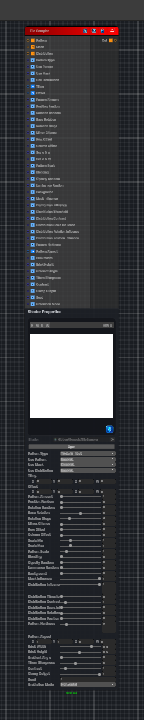

<link rel="stylesheet" href="../_assets/theme.css">

<button type="button" class="genesis-theme-toggle" data-genesis-theme-toggle aria-label="Toggle theme">Dark</button>

---
category: "Tiling"
---

# Tile Sampler

> Purpose: tile-sample an atlas texture across UV space and pick/transform tiles per grid cell using seeded randomness, pattern modes (including Gaussian variants), optional pattern texture input, and per-instance jitter/rotation/scale/mirror.

## Description

Purpose: tile-sample an atlas texture across UV space and pick/transform tiles per grid cell using seeded randomness, pattern modes (including Gaussian variants), optional pattern texture input, and per-instance jitter/rotation/scale/mirror.

Property	Type / Range	Description
_Atlas	2D texture	Atlas/tileset texture (row-major layout).
_UseAtlas	Int (0/1)	Enable/disable atlas sampling.
_Scale	Vector	Grid tiling across UVs (cells per unit).
_TilesCols	Int	Number of columns in the atlas.
_TilesRows	Int	Number of rows in the atlas.
_Density	Range(1,16)	Instances per cell (samples per cell).
_Jitter	Range(0,1)	Position jitter inside each cell.
_RotJitter	Range(0,6.283)	Rotation jitter in radians.
_ScaleMin / _ScaleMax	Range(0.01,2)	Per-instance scale range.
_MirrorChance	Range(0,1)	Probability of horizontal mirror per instance.
_Pattern	Enum	Pattern mode selector (see Pattern Types).
_PatternTex	2D texture	Optional pattern input to bias tile selection.
_UsePatternTex	Int (0/1)	Enable/disable pattern texture usage.
_GaussianSigma	Range(0.01,10)	Width of Gaussian for Gaussian pattern modes.
_BlendSoftness	Range(0.0,1.0)	Softening of tile mask edges.
_Contrast	Range(0.5,4)	Final contrast exponent applied to output.
_Seed	Int	Randomization seed for deterministic variation.

Pattern Types
How tile indices are chosen per cell. The shader maps a scalar in [0,1) to a tile index (0..TilesCols*TilesRows-1). The pattern scalar can be modulated by the optional _PatternTex.

Enum Value	Name	Behavior
0	Random	Per-instance random selection using seeded hash.
1	CellIndex	Deterministic hash of cell coordinates (unique per cell).
2	Rows	Varies by cell row (ip.y).
3	Columns	Varies by cell column (ip.x).
4	Diagonal	Varies by ip.x + ip.y (diagonal bands).
5	Radial	Varies by distance from origin (cell center).
6	Checker	Alternating pattern like a checkerboard.
7	GaussianRows	Gaussian weight across rows (centered by default).
8	GaussianColumns	Gaussian weight across columns.
9	GaussianRadial	Gaussian falloff with radial distance from origin.

## Inputs

| Name | Type | Description |
|------|------|-------------|
| Pattern | Texture2D |  |
| Mask | Texture2D |  |
| Distribution | Texture2D |  |
| Pattern Type | Single |  |
| Use Pattern | Single |  |
| Use Mask | Single |  |
| Use Distribution | Single |  |
| Tiling | Vector4 | Number of tiles in X,Y |
| Offset | Vector4 | Global UV offset |
| Pattern Amount | Single | Shapes per tile |
| Position Random | Single | Random position offset inside tile |
| Rotation Random | Single | Random rotation amount in radians |
| Base Rotation | Single | Base rotation in radians |
| Rotation Steps | Single |  |
| Mirror Chance | Single |  |
| Row Offset | Single |  |
| Column Offset | Single |  |
| Scale Min | Single | Min random scale |
| Scale Max | Single | Max random scale |
| Pattern Scale | Single | Global pattern scale |
| Blending | Single | Blending mode |
| Opacity Random | Single |  |
| Luminance Random | Single |  |
| Background | Single |  |
| Mask Influence | Single | Mask influence on output |
| Distribution Influence | Single | Distribution map influence on spawn probability |
| Distribution Threshold | Single | Minimum distribution value needed to spawn |
| Distribution Contrast | Single | Contrast on distribution map |
| Distribution Scale Influence | Single | Distribution map affects scale |
| Distribution Rotation Influence | Single | Distribution map affects rotation |
| Distribution Position Influence | Single | Distribution map affects position |
| Pattern Hardness | Single | Edge hardness and exponent shaping |
| Pattern Aspect | Vector4 | Aspect ratio X,Y for procedural patterns |
| Brick Width | Single | Brick width fraction |
| Brick Height | Single | Brick height fraction |
| Gradient Angle | Single | Gradiation direction in radians |
| Thorn Sharpness | Single | Thorn sharpness |
| Contrast | Single | Contrast shaping |
| Clamp Output | Single | Output clamp |
| Seed | Single | Random seed |
| Gradiation Mode | Single |  |

## Outputs

| Name | Type |
|------|------|
| Out | Texture2D |

## Parameters

| Setting | Type | Default | Description |
|---------|------|---------|-------------|
| Pattern Type | int | 0 | Controls the pattern type. |
| Use Pattern | Enum | 1 | Controls the use pattern. |
| Use Mask | Enum | 0 | Controls the use mask. |
| Use Distribution | Enum | 1 | Controls the use distribution. |
| Tiling | Vector | (8,8,0,0) | Number of tiles in X,Y |
| Offset | Vector | (0,0,0,0) | Global UV offset |
| Pattern Amount | Range | 1 | Shapes per tile |
| Position Random | Range | 0.0 | Random position offset inside tile |
| Rotation Random | Range | 0.0 | Random rotation amount in radians |
| Base Rotation | Range | 0 | Base rotation in radians |
| Rotation Steps | Int Range | 4 | Controls the rotation steps. |
| Mirror Chance | Range | 0 | Controls the mirror chance. |
| Row Offset | Range | 0 | Controls the row offset. |
| Column Offset | Range | 0 | Controls the column offset. |
| Scale Min | Range | 1.0 | Min random scale |
| Scale Max | Range | 1.0 | Max random scale |
| Pattern Scale | Range | 1.0 | Global pattern scale |
| Blending | Enum | 0.0 | Blending mode |
| Opacity Random | Range | 0 | Controls the opacity random. |
| Luminance Random | Range | 0 | Controls the luminance random. |
| Background | Range | 0 | Controls the background. |
| Mask Influence | Range | 1.0 | Mask influence on output |
| Distribution Influence | Range | 1.0 | Distribution map influence on spawn probability |
| Distribution Threshold | Range | 0.0 | Minimum distribution value needed to spawn |
| Distribution Contrast | Range | 1.0 | Contrast on distribution map |
| Distribution Scale Influence | Range | 0.0 | Distribution map affects scale |
| Distribution Rotation Influence | Range | 0.0 | Distribution map affects rotation |
| Distribution Position Influence | Range | 0.0 | Distribution map affects position |
| Pattern Hardness | Range | 2.0 | Edge hardness and exponent shaping |
| Pattern Aspect | Vector | (1,1,0,0) | Aspect ratio X,Y for procedural patterns |
| Brick Width | Range | 0.8 | Brick width fraction |
| Brick Height | Range | 0.5 | Brick height fraction |
| Gradient Angle | Range | 0.0 | Gradiation direction in radians |
| Thorn Sharpness | Range | 6.0 | Thorn sharpness |
| Contrast | Range | 1.0 | Contrast shaping |
| Clamp Output | Range | 1.0 | Output clamp |
| Seed | int | 1 | Random seed |
| Gradiation Mode | Enum | 0 | Controls the gradiation mode. |

## See Also

- [Back to Tile Sampler](./tiling-index.md)
