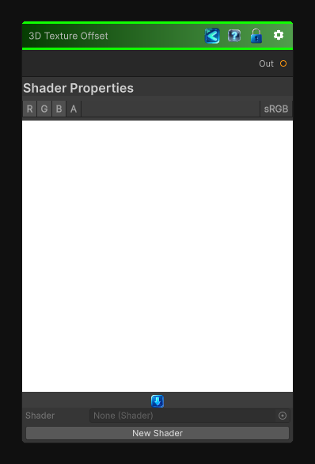

<link rel="stylesheet" href="../_assets/theme.css">

<button type="button" class="genesis-theme-toggle" data-genesis-theme-toggle aria-label="Toggle theme">Dark</button>

---
category: "Transform"
---

# 3D Texture Offset

> 3D Texture Offset Color is a perfect utility node for volumetric workflows — it lets you shift a 3D texture in XYZ space and sample it at an offset

## Description

3D Texture Offset Color is a perfect utility node for volumetric workflows — it lets you shift a 3D texture in XYZ space and sample it at an offset

## Inputs

| Name | Type | Description |
|------|------|-------------|

## Outputs

| Name | Type |
|------|------|

## Parameters

| Setting | Type | Default | Description |
|---------|------|---------|-------------|
| nodeVariables | VariableStorage | AhahGames.GenesisNoise.Graph.VariableStorage | |
| GUID | String | 346f4400-41ca-4339-8570-af0dfab4f03d | |
| expanded | Boolean | False | |

## See Also

- [Back to 3D Texture Offset](./transform-index.md)
