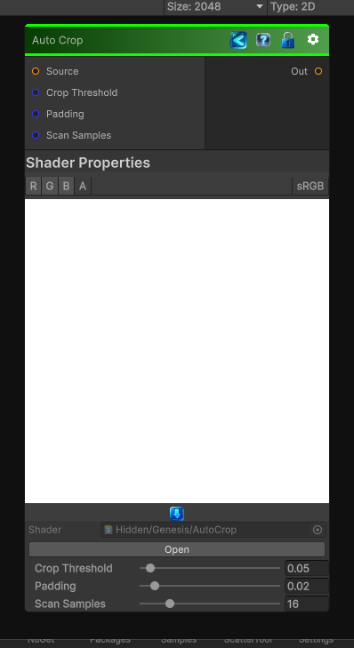

<link rel="stylesheet" href="../_assets/theme.css">

<button type="button" class="genesis-theme-toggle" data-genesis-theme-toggle aria-label="Toggle theme">Dark</button>

---
category: "Transform"
---

# Auto Crop

> It analyzes the non‑empty region of an image (usually based on luminance or alpha), finds the tightest bounding box, and then crops + rescales the result back to full UV space.

## Description

 It analyzes the non‑empty region of an image (usually based on luminance or alpha), finds the tightest bounding box, and then crops + rescales the result back to full UV space.

## Inputs

| Name | Type | Description |
|------|------|-------------|
| Source | Texture2D |  |
| Crop Threshold | Single |  |
| Padding | Single |  |
| Scan Samples | Single |  |

## Outputs

| Name | Type |
|------|------|
| Out | Texture2D |

## Parameters

| Setting | Type | Default | Description |
|---------|------|---------|-------------|
| Crop Threshold | Range | 0.05 | Controls the crop threshold. |
| Padding | Range | 0.02 | Controls the padding. |
| Scan Samples | Range | 16 | Controls the scan samples. |

## See Also

- [Back to Auto Crop](./transform-index.md)
