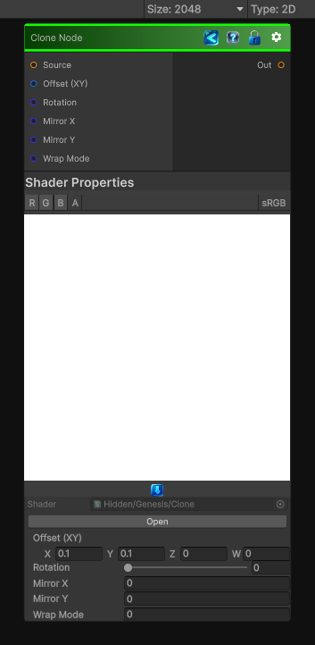

<link rel="stylesheet" href="../_assets/theme.css">

<button type="button" class="genesis-theme-toggle" data-genesis-theme-toggle aria-label="Toggle theme">Dark</button>

---
category: "Transform"
---

# Clone

> Sample from a shifted UV position, optionally with mirroring, rotation, offset, and wrap/clamp behavior. It’s basically a UV‑offset sampler with a few quality‑of‑life features.

## Description

Sample from a shifted UV position, optionally with mirroring, rotation, offset, and wrap/clamp behavior. It’s basically a UV‑offset sampler with a few quality‑of‑life features.

## Inputs

| Name | Type | Description |
|------|------|-------------|

## Outputs

| Name | Type |
|------|------|

## Parameters

| Setting | Type | Default | Description |
|---------|------|---------|-------------|
| Offset (XY) | Vector | (0.1, 0.1, 0, 0) | Controls the offset (xy). |
| Rotation | Range | 0.0 | Controls the rotation. |
| Mirror X | Int | 0 | Controls the mirror x. |
| Mirror Y | Int | 0 | Controls the mirror y. |
| Wrap Mode | Int | 0 | Controls the wrap mode. |

## See Also

- [Back to Clone](./transform-index.md)
