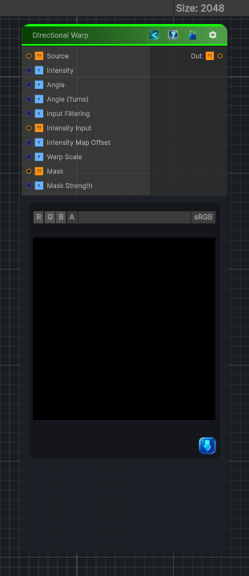

<link rel="stylesheet" href="../_assets/theme.css">

<button type="button" class="genesis-theme-toggle" data-genesis-theme-toggle aria-label="Toggle theme">Dark</button>

---
category: "Transform"
---

# Directional Warp

> Directional Warp = input warped along a direction, with intensity modulated by a grayscale map.

## Description

Directional Warp = input warped along a direction, with intensity modulated by a grayscale map.

✔ Warp direction (angle or turns)
✔ Warp intensity
✔ Warp scale
✔ Intensity input map offset
✔ Input filtering mode (nearest / bilinear)
✔ Warp noise / pattern input
✔ Optional warp mask

## Inputs

| Name | Type | Description |
|------|------|-------------|
| Source | Texture2D | Input texture to warp |
| Intensity | Single | Warp intensity amount |
| Angle | Single | Warp direction angle in degrees |
| Angle (Turns) | Single | Warp direction angle in turns (1 turn 360 degrees). When non zero, this overrides Angle. |
| Input Filtering | Single | Input filtering mode. Off nearest, On bilinear. |
| Intensity Input | Texture2D | Intensity input (grayscale) |
| Intensity Map Offset | Single | Value subtracted from intensity input before scaling by Intensity |
| Warp Scale | Single | Warp map scale |
| Mask | Texture2D | Optional mask |
| Mask Strength | Single | Mask strength |

## Outputs

| Name | Type |
|------|------|
| Out | Texture2D |

## Parameters

| Setting | Type | Default | Description |
|---------|------|---------|-------------|
| Source | 2D | white | Input texture to warp |
| Intensity | Float | 0.1 | Warp intensity amount |
| Angle | Float | 0.0 | Warp direction angle in degrees |
| Angle (Turns) | Float | 0.0 | Warp direction angle in turns (1 turn 360 degrees). When non zero, this overrides Angle. |
| Input Filtering | Toggle | 1.0 | Input filtering mode. Off nearest, On bilinear. |
| Intensity Input | 2D | gray | Intensity input (grayscale) |
| Intensity Map Offset | Float | 0.5 | Value subtracted from intensity input before scaling by Intensity |
| Warp Scale | Float | 4.0 | Warp map scale |
| Mask | 2D | white | Optional mask |
| Mask Strength | Float | 1.0 | Mask strength |

## See Also

- [Back to Directional Warp](./transform-index.md)
