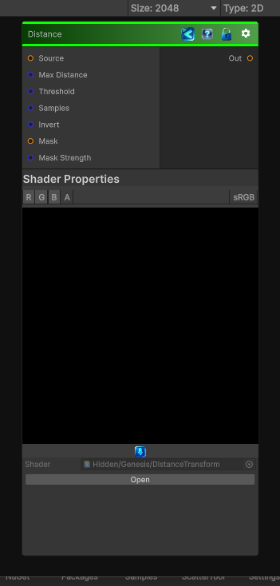

<link rel="stylesheet" href="../_assets/theme.css">

<button type="button" class="genesis-theme-toggle" data-genesis-theme-toggle aria-label="Toggle theme">Dark</button>

---
category: "Transform"
---

# Distance

> Substance’s Distance node supports:

## Description

Substance’s Distance node supports:
Euclidean distance
Adjustable max distance
Inversion
Works on grayscale masks
Produces smooth falloff fields

## Inputs

| Name | Type | Description |
|------|------|-------------|

## Outputs

| Name | Type |
|------|------|

## Parameters

| Setting | Type | Default | Description |
|---------|------|---------|-------------|
| Source | 2D | white | Input mask (white is features) |
| Max Distance | Float | 0.25 | Max distance in UV units |
| Threshold | Float | 0.5 | Threshold for binary mask |
| Samples | Int | 16 | Number of radial samples |
| Invert | Enum | 0 | Invert output |
| Mask | 2D | white | Optional mask texture |
| Mask Strength | Float | 1.0 | How strongly the mask affects the distance |

## See Also

- [Back to Distance](./transform-index.md)
