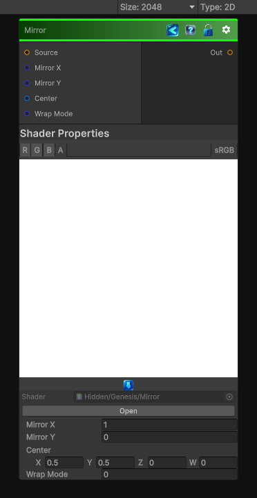

<link rel="stylesheet" href="../_assets/theme.css">

<button type="button" class="genesis-theme-toggle" data-genesis-theme-toggle aria-label="Toggle theme">Dark</button>

---
category: "Transform"
---

# Mirror

> ✔ Reflect UVs across X and/or Y

## Description

 ✔ Reflect UVs across X and/or Y
✔ Optionally mirror around a custom center
✔ Wrap or clamp
✔ Deterministic, no derivatives
✔ Works for 2D / 3D / Cube textures
This is perfect for:
- Symmetry
- Pattern doubling
- Kaleidoscope bases
- Seam removal
- Procedural shape construction

## Inputs

| Name | Type | Description |
|------|------|-------------|

## Outputs

| Name | Type |
|------|------|

## Parameters

| Setting | Type | Default | Description |
|---------|------|---------|-------------|
| Mode | Enum | 0 | Controls the mode. |
| Corner | Enum | 0 | Controls the corner. |
| Corner Depth_3D | Enum | 0 | Controls the corner depth_3d. |
| Offset | Range | 0.5 | Controls the offset. |

## See Also

- [Back to Mirror](./transform-index.md)
