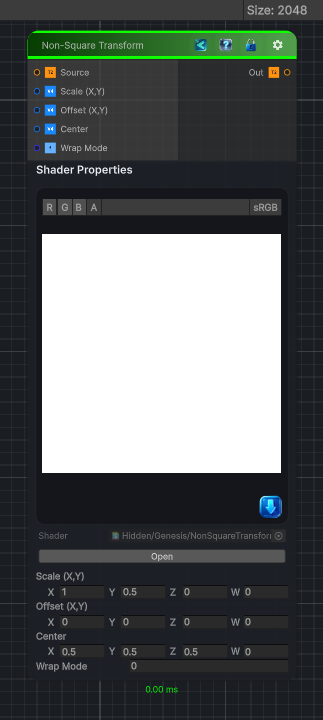

<link rel="stylesheet" href="../_assets/theme.css">

<button type="button" class="genesis-theme-toggle" data-genesis-theme-toggle aria-label="Toggle theme">Dark</button>

---
category: "Transform"
---

# Non-Square Transform

> ✔ Remap a non‑square texture into square UV space

## Description

 ✔ Remap a non‑square texture into square UV space
✔ Stretch or compress X/Y independently
✔ Maintain aspect ratio or override it
✔ Recenter the transformed region
✔ Use it as a pre‑warp for polar, kaleidoscope, shape, or pattern nodes
In Genesis, this node is used constantly for:
- Converting rectangular photos into square procedural space
- Preparing masks for polar transforms
- Fixing aspect‑ratio distortions
- Making procedural shapes uniform
- Pre‑warping noise

## Inputs

| Name | Type | Description |
|------|------|-------------|
| Source | Texture2D |  |
| Scale (X,Y) | Vector4 |  |
| Offset (X,Y) | Vector4 |  |
| Center | Vector4 |  |
| Wrap Mode | Single |  |

## Outputs

| Name | Type |
|------|------|
| Out | Texture2D |

## Parameters

| Setting | Type | Default | Description |
|---------|------|---------|-------------|
| Scale (X,Y) | Vector | (1.0, 0.5, 0, 0) | Controls the scale (x,y). |
| Offset (X,Y) | Vector | (0.0, 0.0, 0, 0) | Controls the offset (x,y). |
| Center | Vector | (0.5, 0.5, 0.5, 0) | Controls the center. |
| Wrap Mode | Int | 0 | Controls the wrap mode. |

## See Also

- [Back to Non-Square Transform](./transform-index.md)
